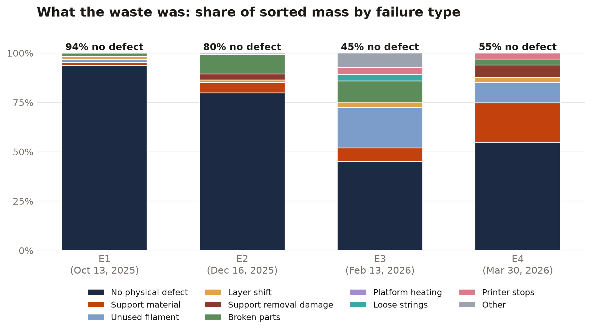
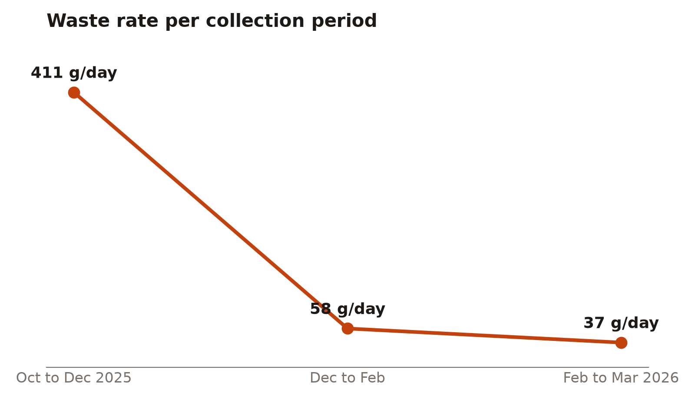
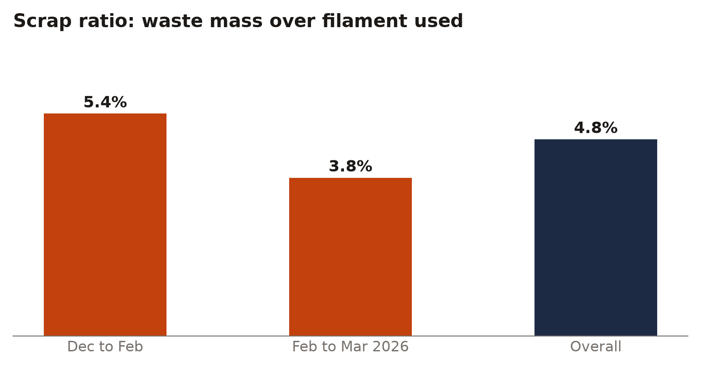
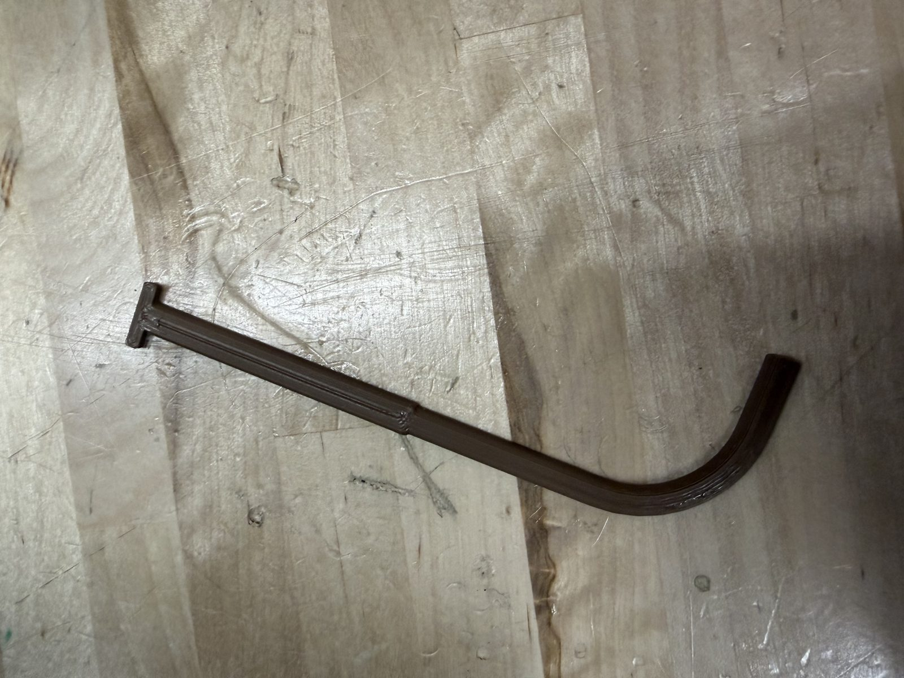
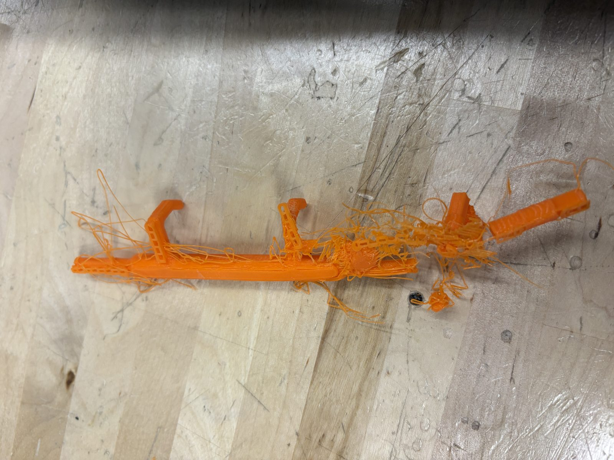

# Makerspace waste characterization

What gets thrown away at a busy university 3D-printing makerspace, and why. An undergraduate research project in Prof. Mickey Clemon's group at UIUC MechSE, fall 2025 to spring 2026, by Dhun Nishchal, Michelle Malletsky and Diyun Zheng. Presented as a poster at the UIUC Undergraduate Research Symposium in April 2026.

## Findings

<picture>
<source media="(prefers-color-scheme: dark)" srcset="charts/composition-dark.png">

</picture>

- **The biggest waste stream was parts with nothing physically wrong with them.** Across the four collection events, 45 to 94 percent of the sorted mass was prints that came out fine but did not fit or were not needed: tolerance mistakes, wrong dimensions, superseded iterations.
- **The waste rate fell by more than 91 percent over the study**, from 411 g/day in the first period to 37 g/day in the last.
- **Overall scrap ratio of 4.8 percent**: for every 100 g of filament used, 4.8 g ended up in the bin.

<picture>
<source media="(prefers-color-scheme: dark)" srcset="charts/waste-rate-dark.png">

</picture>
<picture>
<source media="(prefers-color-scheme: dark)" srcset="charts/scrap-ratio-dark.png">

</picture>

## Method

Jackson Innovation Studio is the main student-facing makerspace in UIUC's Mechanical Engineering Building, with roughly 50 FDM printers, mostly Ultimaker S5s printing PLA and ABS.

- Four collection events between October 2025 and March 2026, every 2 to 3 weeks of active use. All waste was weighed; large batches were sampled and small batches fully sorted.
- Every sample was sorted into failure categories and each category weighed. The categories grew as new modes appeared: no physical defect, support material, unused filament, layer shift, support removal damage, broken parts, platform heating, loose strings, printer stops, other.
- A filament inventory at each event (full and partial spools) gave material usage per period.
- Metrics: waste rate (g/day), usage rate (g/day) and scrap ratio (waste over material used).

## Proposed interventions

| Waste it targets | Intervention |
|---|---|
| Preventable failures: support misuse, poor orientation, wrong settings | **Pre-print standardization.** A short session at the start of each semester in the high-use ME design courses, backed by a poster in the studio and an online checklist: material choice, orientation, support reduction, default Cura profiles for the Ultimaker S5, and when to print a test section first. |
| Removal breakage, support scarring, borderline parts | **Post-failure recovery station.** Pliers, flush cutters, files, sandpaper, deburring tools and reamers with guidance on when a part can be reworked instead of scrapped. |
| Discarded functional parts | **Gear library.** Discarded gears labeled with tooth count and module, available to teams that need a matching gear. |

The studio's volunteers already give print-optimization guidance and cap print length at 48 hours; the interventions were scoped around those existing practices.

## Data and analysis

| File | Contents |
|---|---|
| `data/waste_by_category.csv` | Sorted mass per failure category at each event, in pounds and grams, with each category's share of the sorted sample |
| `data/periods.csv` | Waste rate, usage rate and scrap ratio per period |
| `analysis/waste_analysis.ipynb` | The calculations behind the numbers above |
| `charts/` | The charts on this page, in light and dark variants |

## Next phase

Energy monitoring of the same printers with a DENT ELITEpro XC power logger, comparing Ultimaker S5, Bambu Lab X2D and Bambu Lab P2S across preheating, printing, cooling and idle. The enclosure design is documented at [printer-energy-monitor-wiring](https://github.com/DiyunZ/printer-energy-monitor-wiring).

## Credits

Dhun Nishchal, Michelle Malletsky and Diyun Zheng, Clemon Research Group, Mechanical Science and Engineering, University of Illinois Urbana-Champaign. Thanks to the Jackson Innovation Studio staff and volunteers for access and support, and to Dr. Mickey Clemon for supporting the project.
